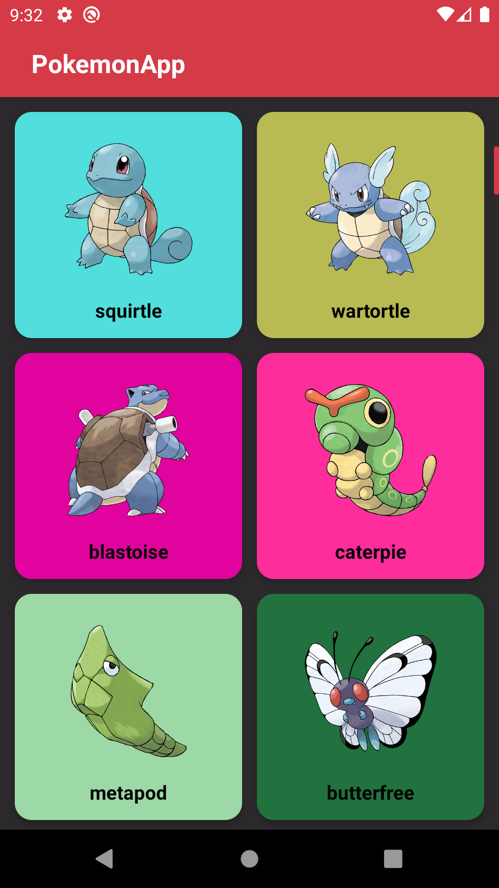
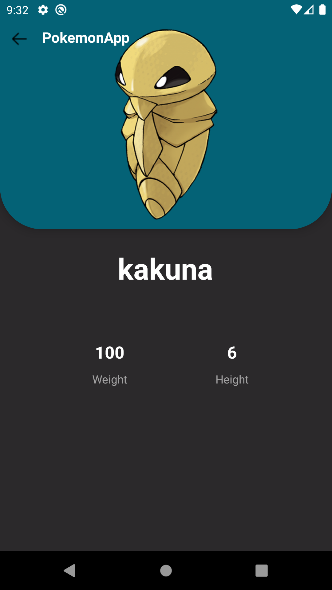

# PokemonApp
I made a project using the api available on the https://pokeapi.co/ site.

## Features

100% Kotlin <dt>
MVVM architecture <dt>
Retrofit <dt>
Android Architecture Components<dt>
ViewModel <dt>
LiveData <dt>
Glide <dt>
Data Binding <dt>
Hilt <dt>
Kotlin Coroutines

## Main Page

 <dt>

## Pokemon Detail Page
 <dt>
